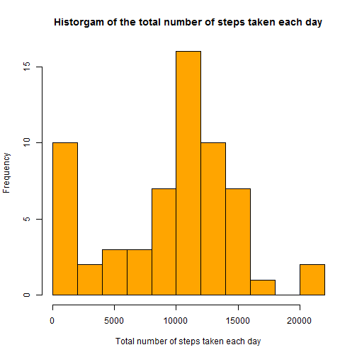
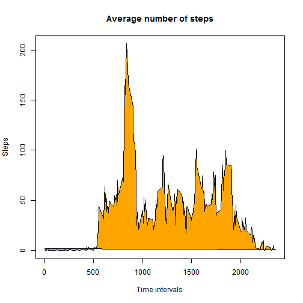
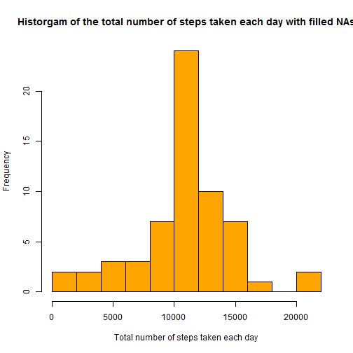
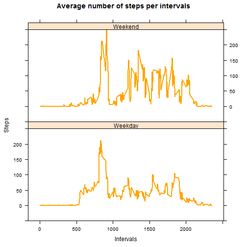

###Loading the data

```r
setwd("~/R/reproducible research/Peer Assignment 01")
dataset <- read.csv("activity.csv", header = TRUE, sep=",", na.strings="NA")
head(dataset)
```

```
##   steps       date interval
## 1    NA 2012-10-01        0
## 2    NA 2012-10-01        5
## 3    NA 2012-10-01       10
## 4    NA 2012-10-01       15
## 5    NA 2012-10-01       20
## 6    NA 2012-10-01       25
```

```r
tail(dataset)
```

```
##       steps       date interval
## 17563    NA 2012-11-30     2330
## 17564    NA 2012-11-30     2335
## 17565    NA 2012-11-30     2340
## 17566    NA 2012-11-30     2345
## 17567    NA 2012-11-30     2350
## 17568    NA 2012-11-30     2355
```
###What is mean total number of steps taken per day? 

*Calculate the total number of steps taken per day*

```r
daily.sum <-aggregate(dataset$steps, by=list(dataset$date), FUN=sum, na.rm=TRUE)
names(daily.sum) <- c("Date", "Total.steps")
head(daily.sum)
```

```
##         Date Total.steps
## 1 2012-10-01           0
## 2 2012-10-02         126
## 3 2012-10-03       11352
## 4 2012-10-04       12116
## 5 2012-10-05       13294
## 6 2012-10-06       15420
```

```r
tail(daily.sum)
```

```
##          Date Total.steps
## 56 2012-11-25       11834
## 57 2012-11-26       11162
## 58 2012-11-27       13646
## 59 2012-11-28       10183
## 60 2012-11-29        7047
## 61 2012-11-30           0
```

*Make a histogram of the total number of steps taken each day*

```r
hist(daily.sum$Total.steps, 
     main="Historgam of the total number of steps taken each day", 
     xlab="Total number of steps taken each day",
     breaks=10,
     col="orange")
```

 

*Calculate and report the mean and median of the total number of steps taken per day*

```r
mean.daily.sum <- mean(daily.sum$Total.steps)
mean.daily.sum 
```

```
## [1] 9354.23
```

```r
median.daily.sum <- median(daily.sum$Total.steps)
median.daily.sum
```

```
## [1] 10395
```
The mean  of the total number of steps taken per day is: **9354.2295082**  
The median of the total number of steps taken per day is: **10395**  

###What is the average daily activity pattern?

*Make a time series plot of the 5-minute interval (x-axis) and the average number of steps taken, averaged across all days (y-axis)*

```r
mean.steps <- aggregate(dataset$steps, by=list(dataset$interval), FUN=mean, na.rm=TRUE)
names(mean.steps) <- c("Interval", "Value")

plot(mean.steps$Interval,mean.steps$Value, 
     type="l",
     xlab="Time intervals",
     ylab="Steps",
     main="Average number of steps")
     polygon(mean.steps$Interval,mean.steps$Value, 
     col="orange")
```

 

*Which 5-minute interval, on average across all the days in the dataset, contains the maximum number of steps?*

```r
max.step <- subset(mean.steps, mean.steps$Value == max(mean.steps$Value))
max.step
```

```
##     Interval    Value
## 104      835 206.1698
```
The 5-minute interval that contains the maximum number of steps is the **835th** interval.  
The maximum number of steps is: **206.1698113**

###Imputing missing values

*Calculate and report the total number of missing values in the dataset (i.e. the total number of rows with NAs)*

```r
num.NAs <- nrow(subset(dataset, is.na(dataset$steps)))
num.NAs
```

```
## [1] 2304
```
In the initial dataset there are **2304** rows with NA step value.  

*Devise a strategy for filling in all of the missing values in the dataset!*

I decided to use the mean number of steps of the relevant 5-minute interval to fill up the missing values.  

*Create a new dataset that is equal to the original dataset but with the missing data filled in!*

```r
      dataset.filled <- dataset                     #initial dataset is duplicated
       for(i in 1:nrow(dataset.filled)) {           #a temporary dataframe is used to fill up NAs
         if (is.na(dataset.filled[i,]$steps)) {
           temp <- subset(mean.steps, dataset.filled[i,]$interval == mean.steps$Interval)
           dataset.filled[i,]$steps <- temp$Value
         }
       }
```


*Make a histogram of the total number of steps taken each day!*

```r
daily.sum.filled <-aggregate(dataset.filled$steps, by=list(dataset.filled$date), FUN=sum)
names(daily.sum.filled) <- c("Date", "Total.steps")
hist(daily.sum.filled$Total.steps, 
     main="Historgam of the total number of steps taken each day with filled NAs", 
     xlab="Total number of steps taken each day",
     breaks=10,
     col="orange")
```

 

*Calculate and report the mean and median total number of steps taken per day!*

```r
mean.daily.sum.filled <- mean(daily.sum.filled$Total.steps)
mean.daily.sum.filled
```

```
## [1] 10766.19
```

```r
median.daily.sum.filled <- median(daily.sum.filled$Total.steps)
median.daily.sum.filled
```

```
## [1] 10766.19
```

*Do these values differ from the estimates from the first part of the assignment?*

```r
mean.daily.sum.filled - mean.daily.sum
```

```
## [1] 1411.959
```

```r
median.daily.sum.filled - median.daily.sum
```

```
## [1] 371.1887
```
Both mean and median values became higher.

*What is the impact of imputing missing data on the estimates of the total daily number of steps?*

```r
daily.sum.diff <- as.data.frame(daily.sum$Total.steps - daily.sum.filled$Total.steps)
entirely.imputted.days <- nrow(subset(daily.sum.diff, 
                                      daily.sum.diff$`daily.sum$Total.steps - daily.sum.filled$Total.steps` != 0))
entirely.imputted.days
```

```
## [1] 8
```
**8 days** had not any initial number of steps data, these days were imputted entirely with mean values.

###Are there differences in activity patterns between weekdays and weekends?

*Create a new factor variable in the dataset with two levels – “weekday” and “weekend” indicating whether a given date is a weekday or weekend day.*

```r
dataset.filled$weekday <- as.factor(ifelse(weekdays(as.Date(dataset.filled$date)) %in% 
                                      c("szombat","vasárnap","Saturday","Sunday"), 
                                      "Weekend", 
                                      "Weekday")) 
str(dataset.filled)
```

```
## 'data.frame':	17568 obs. of  4 variables:
##  $ steps   : num  1.717 0.3396 0.1321 0.1509 0.0755 ...
##  $ date    : Factor w/ 61 levels "2012-10-01","2012-10-02",..: 1 1 1 1 1 1 1 1 1 1 ...
##  $ interval: int  0 5 10 15 20 25 30 35 40 45 ...
##  $ weekday : Factor w/ 2 levels "Weekday","Weekend": 1 1 1 1 1 1 1 1 1 1 ...
```

*Make a panel plot containing a time series plot of the 5-minute interval (x-axis) and the average number of steps taken, averaged across all weekday days or weekend days (y-axis).*

```r
library(lattice)
xyplot(steps ~ interval | weekday, 
         data = dataset.filled, 
         layout = c(1, 2),
         col="orange",
         lw=2,
         xlab="Intervals", 
         ylab="Steps", 
         main="Average number of steps per intervals", 
         type = "a",
         scale=list(y=list(limits=c(-50,250)))
         )
```

 
